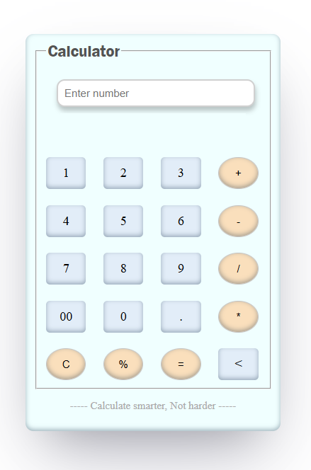
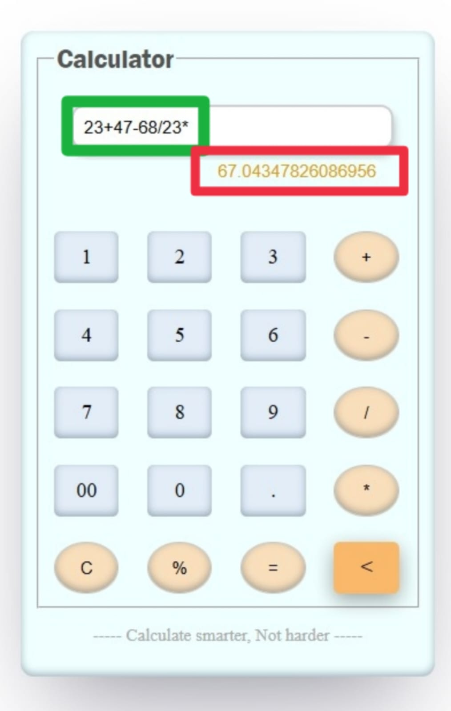
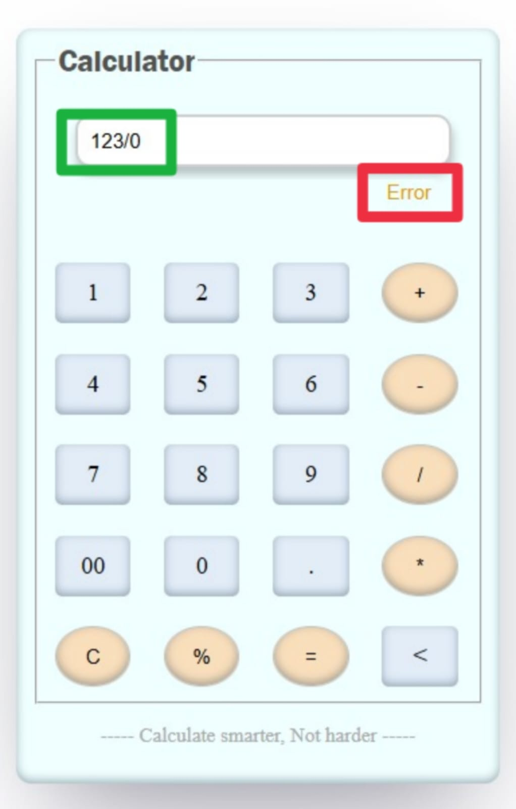

# Advanced Calculator

A **Java-based Advanced Calculator Web Application** designed to evaluate complex mathematical expressions containing multiple operations within a single input string.

The application provides a clean and interactive user interface and performs real-time calculations using backend logic implemented in **Java and Spring Boot**. The system ensures accurate computation while handling invalid inputs and arithmetic errors efficiently.

Built with **HTML, CSS, JavaScript, Java, Spring Boot, and Thymeleaf**, this project demonstrates full-stack development with seamless interaction between frontend and backend components.

---

## 📸 Application Preview

<table>
  <tr>
    <td align="center">
       
      <b>Clean and simple calculator interface</b>
    </td>
    <td align="center">
       
      <b>Supports multiple arithmetic operations</b>
    </td>
    <td align="center">
       
      <b>Error handling for invalid expressions</b>
    </td>
  </tr>
</table>

---

## 🚀 Features

- Evaluate **multiple arithmetic operations** within a single expression
- Real-time evaluation as operands are entered
- Supports common arithmetic operations:
  - Addition (`+`)
  - Subtraction (`-`)
  - Multiplication (`*`)
  - Division (`/`)
  - Modulus (`%`)
- Interactive and responsive user interface
- Backspace functionality to remove the last entered character
- Intelligent validation to prevent invalid expressions
- Robust error handling for scenarios such as:
  - Division by zero
  - Invalid operator sequences
  - Incorrect input formats
- Smooth and user-friendly calculation experience

---

## 🛠️ Technologies Used

### Frontend
- **HTML** – Structure of the calculator interface  
- **CSS** – Styling and layout design  
- **JavaScript** – Handling user interactions and input logic  
- **Thymeleaf** – Server-side rendering and template integration  

### Backend
- **Java** – Core calculation logic and expression evaluation  
- **Spring Boot** – Backend framework for handling requests and application structure  

---

## ⚙️ Application Workflow

1. Users input numbers and operators through the calculator interface.
2. Each operand and operator entered is processed in sequence.
3. The expression is sent to the backend where **Java-based logic evaluates the mathematical operations**.
4. The calculated result is dynamically returned and displayed on the interface.
5. If an invalid expression or arithmetic error occurs (such as **division by zero**), the system gracefully displays an appropriate error message.

This architecture ensures a **stable, efficient, and user-friendly calculator application capable of handling complex arithmetic expressions**.

---

## 📌 Project Purpose

This project was developed to demonstrate:

- Full-stack web development using **Spring Boot and Thymeleaf**
- Implementation of **expression evaluation logic in Java**
- Building an **interactive and responsive user interface**
- Proper **error handling and input validation** in a web-based calculator system
